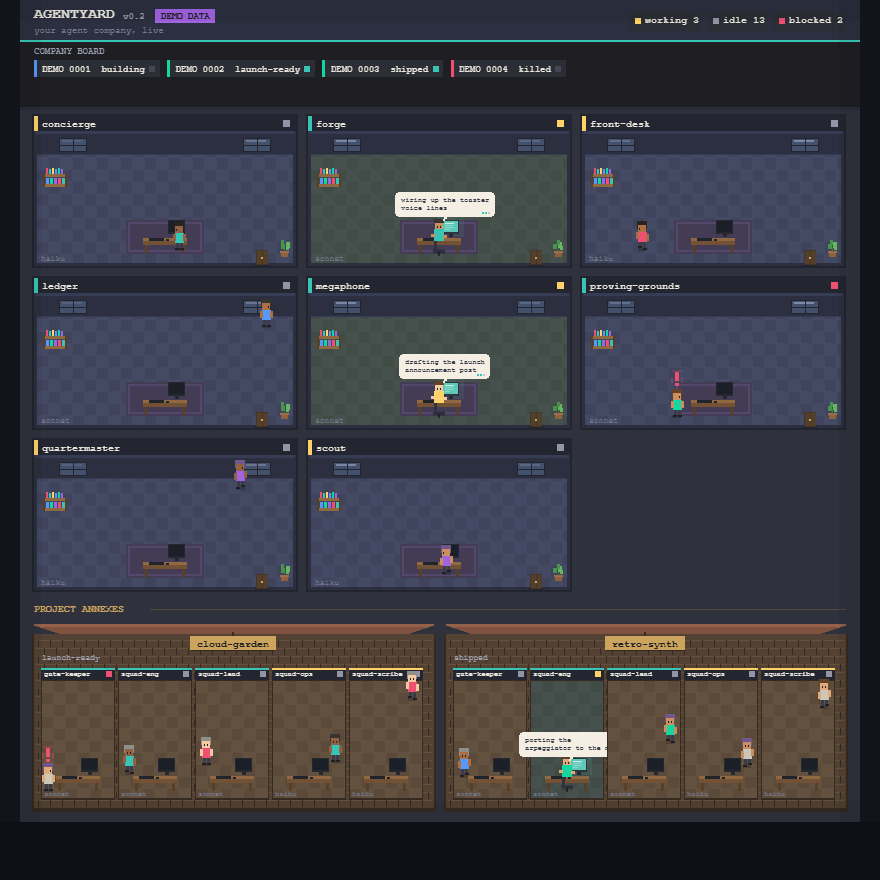

# Agentyard

A pixel-art view of your agent company, in the VS Code panel.

Agentyard reads a local repo and draws every department and project team as a
room in a top-down, tycoon-style office. Agents walk around when idle, sit down
and type when working, and flag a red `!` when blocked — so one glance tells you
who is busy and what they are doing. No network, no API keys, no telemetry.

Built by the Founder for their own use while running an agent-driven company.



*(screenshot uses the bundled synthetic demo data, not a real company)*

## Run view

A header toggle switches between the office scene and a **Run** view — a real
embedded terminal running an interactive Claude Code session in the workspace
folder, using your existing CLI login (no API key). It behaves exactly like the
Claude Code terminal: permission prompts appear **in the panel** and you answer
`y/n` there, follow-up messages continue the **same** session, plan mode works.
**New thread** kills the session and starts fresh. Closing the panel or
reloading the window leaves no orphan `claude` process.

The terminal is [xterm.js](https://xtermjs.org) in the webview wired to a
[node-pty](https://github.com/homebridge/node-pty-prebuilt-multiarch) pseudo-
terminal in the extension host. node-pty is a native component; it ships with
prebuilt binaries for **win32-x64, linux-x64, linux-arm64**. On a platform with
no prebuilt binary the Run view falls back automatically to the older
non-interactive feed (`claude -p … --output-format stream-json`) and shows a
one-line notice — the rest of the extension is unaffected. **Agentyard: Open
Claude Code Terminal** opens a full session in a normal VS Code terminal and is
always available.

**Platform support:** the Office view runs everywhere; the embedded terminal
runs on win32-x64 / linux-x64 / linux-arm64, and elsewhere the Run view falls
back to the headless feed.

**Copy / paste & attachments.** In the terminal, `Ctrl/Cmd+C` copies the
selection (with no selection it still interrupts), `Ctrl+Shift+C` always copies,
and `Ctrl/Cmd+V` / `Ctrl+Shift+V` / `Shift+Insert` paste; right-click copies or
pastes. The **📎 Attach** button (on both the terminal and the headless feed)
opens the file picker and inserts the path(s) into the prompt without submitting
— paths with spaces are quoted. Paste an image, or drag files onto the view, and
Agentyard writes the image to `agentyard.attachmentsDir` (default
`.agentyard/tmp`, inside the workspace) and inserts its path, since Claude Code
reads images by path. `agentyard.keepAttachments` (default `false`) clears that
folder on Run-view init and **New thread**; `agentyard.maxAttachmentMB` (default
`10`) caps a single paste/drop.

Settings: `agentyard.claudePath` (default `claude`), `agentyard.runView`
(`terminal` | `headless`, default `terminal`), `agentyard.claudeExtraArgs`
(appended verbatim, e.g. `["--model", "opus"]`), `agentyard.claudePermissionMode`
(default `default`; `plan` starts the session in plan mode). On Windows the CLI
is resolved to a real executable and spawned with no shell — `cmd.exe` is never
invoked (see *How it's built*). Nothing about the session is written to disk by
Agentyard.

## The panel tab

Install the extension and an **Agentyard** tab appears in the bottom panel, next
to Terminal / Output / Problems / Ports. Click it and the office is there — no
command to run. (There is also an **Agentyard: Focus Panel** command if you want
a keybinding.)

## What it shows

- **Department rooms** — one per file in `.claude/agents/*.md`. The wall sign
  shows the agent `name`, a coloured stripe for its `model` (teal = sonnet,
  yellow = haiku), and a status pip.
- **Project annexes** — one building per project in `company.db` that has a
  non-NULL `repo_url`, each with its team (from
  `templates/project-repo/.claude/agents/`, or the bundled default roles). When a
  build runner is live inside that repo — a subagent whose working directory is
  inside the project's `local_path`, or the repo-build runner type — the annex
  team shows as **working** with a `building…` sign, so the office tells you which
  product is being built right now. Falls back to the plain annex when there is
  no `company.db` or `local_path`.
- **Live status** — from `status_log` (latest row per `project_id` + `department`):
  - `working` → the agent sits at the desk, monitor on, a thought bubble showing
    the latest note.
  - `idle` (or no row yet) → the agent walks a path around the room.
  - `blocked` → the agent stands up with a bouncing red `!`.
- **Company board** (top) — every row in `projects` with its `current_stage`.
- **Click any agent** → info panel: name, model, status, latest note, and how
  long ago it was updated.

Data refreshes every ~3s (configurable), plus on file change when running inside
VS Code against a real workspace.

## Data: synthetic by default

The repo ships **synthetic fixtures** under `dev-data/` (fake departments, fake
`DEMO-*` projects, fake statuses). Everything below runs against those unless you
explicitly point it at a real workspace. Regenerate them with:

```bash
npm run demo-data
```

A "real workspace" is any folder that contains `state/company.db` and
`.claude/agents/` (optionally `templates/project-repo/.claude/agents/`).

## Run it in a browser (fast iteration)

```bash
npm install            # first time only
npm run dev            # -> http://localhost:4173  (synthetic demo data)
```

`npm run dev` starts a tiny zero-dependency static server
(`scripts/dev-server.mjs`) that serves the exact same `webview/` the extension
loads.

- Point it at real data:
  `AGENTYARD_REPO=/path/to/company-repo npm run dev`
  (reads `<root>/state/company.db` + `<root>/.claude/agents/`).
- Change the port: `PORT=5000 npm run dev`.

## Run it as a VS Code extension (from source)

1. Open **this repo** in VS Code.
2. Press **F5** → **"Run Agentyard Extension"**.
3. In the new window, open the bottom panel and pick the **Agentyard** tab.

With no matching workspace open, the panel shows the bundled synthetic demo. Open
a folder that has `state/company.db` + `.claude/agents/` (or use the
**"Run against the company repo"** launch config) to see real data.

Settings (`agentyard.*`): `dbPath` (default `state/company.db`),
`agentsGlob` (default `.claude/agents`), `pollSeconds` (default `3`).

## Install the packaged build

```bash
npx vsce package                       # -> agentyard-1.0.0.vsix
code --install-extension agentyard-1.0.0.vsix
```

## Sanity check

```bash
npm run sanity
```

Runs entirely against the bundled synthetic fixtures: parses the fake agent
files, opens `dev-data/demo.db` through the same sql.js build the webview uses,
builds the office model, runs a render pass against a recording canvas stub, and
checks the extension manifest wires up the panel view. No browser, no network,
no real data.

## How it's built

- **Rendering**: HTML5 `<canvas>`, vanilla JS, `image-rendering: pixelated`, one
  fixed palette in `webview/js/palette.js`, one tile size, procedurally-drawn
  sprites (no art assets).
- **SQLite** and **the terminal**: [sql.js](https://github.com/sql-js/sql.js)
  (MIT) and [xterm.js](https://xtermjs.org) + `addon-fit` (MIT), **vendored**
  into `webview/vendor/` — never fetched from a CDN at runtime. Re-copy them with
  `npm run vendor` after bumping a version in `package.json`.
- **The pseudo-terminal**: `@homebridge/node-pty-prebuilt-multiarch` (MIT), the
  only native module. It ships prebuilt binaries; the Run view degrades to the
  headless feed on any platform where the binary can't load. The Electron-ABI
  rebuild step for future VS Code engine bumps is documented in `CLAUDE.md`.
- **Portability**: the same `webview/` runs in a plain browser and in the VS Code
  panel. All VS Code APIs sit behind `webview/js/adapter.js`; the browser build
  talks to `scripts/dev-server.mjs` over HTTP instead (which previews the
  headless feed, since the terminal needs the extension host).

```
extension.js            VS Code activation + WebviewViewProvider + file watchers
shared/frontmatter.js   tiny YAML-frontmatter reader (Node, shared)
dev-data/               synthetic demo fixtures (tracked)
scripts/dev-server.mjs  zero-dep browser dev server
scripts/make-demo-data.mjs  regenerates dev-data/
scripts/make-icon.mjs   regenerates media/icon.png
scripts/sanity.mjs      headless smoke test
webview/
  index.html            browser entry
  css/style.css
  js/palette.js         the one palette + colour helpers
  js/sprites.js         procedural pixel sprites
  js/db.js              sql.js loader + queries
  js/adapter.js         browser <-> VS Code data adapter
  js/model.js           merges agents + db rows into the office model
  js/render.js          scene layout + canvas drawing
  js/run.js             the headless Run view: feed rendering + send/cancel/new-thread
  js/term.js            the terminal Run view: xterm.js surface <-> pty wiring
  js/termclip.js        pure copy/paste key handler + image-blob helper (tested)
  js/main.js            poll loop, render loop, click + info panel, view toggle
  vendor/               vendored sql.js + xterm.js (MIT, see *-LICENSE files)
shared/claudeArgs.js    builds the claude argv — headless (`-p`) and interactive (pure, tested)
shared/winWrap.js       resolves a Windows .cmd/.bat CLI shim to the real exe (no cmd.exe)
shared/streamJson.js    parses the stream-json NDJSON into feed items (pure)
shared/killTree.js      kills the run's / terminal's whole process tree
shared/attach.js        builds the attachment path-insert string + safe image temp-write (pure, tested)
```

## License

MIT — see `LICENSE`. Bundled sql.js is MIT, see `webview/vendor/sql.js-LICENSE`.
