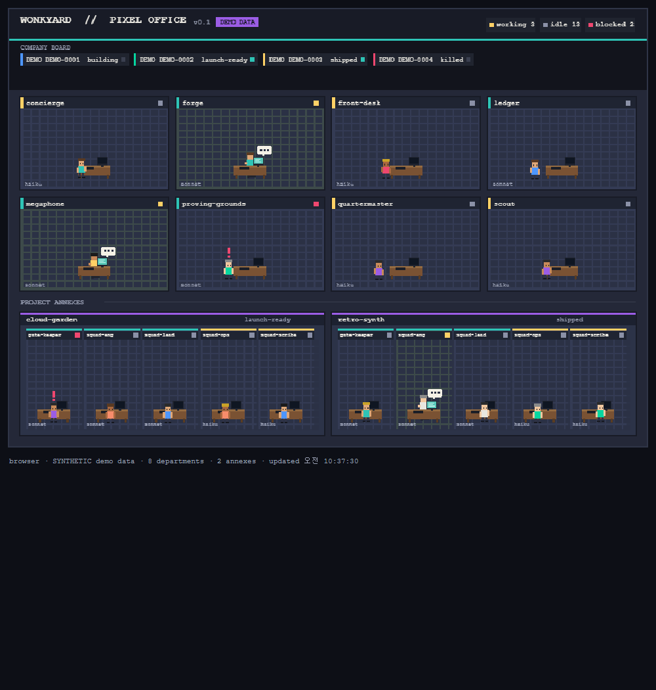

# WONKYARD Pixel Office

A pixel-art, top-down, mobile-tycoon-game view of a whole company —
departments, project repo teams, and every agent's live status — read straight
from a local repo. No network, no API keys, no telemetry.

Think *Game Dev Story* for your org chart. It replaces the third-party
Ctrl/Cubicles extension.



*(screenshot uses the bundled synthetic demo data, not a real company)*

## What it shows

- **Department rooms** — one per file in `.claude/agents/*.md`. Room label shows
  the agent `name`, a coloured stripe for its `model` (teal = sonnet, yellow =
  haiku), and a status pip.
- **Project annexes** — one building per project in `company.db` that has a
  non-NULL `repo_url`, each with its 5-person team (from
  `templates/project-repo/.claude/agents/`, or the bundled default roles).
- **Live status** — from `status_log` (latest row per `project_id` + `department`):
  - `working` → sprite sits at the desk, monitor on, typing, "…" work bubble.
  - `idle` (or no row yet) → sprite stands and wanders near the desk.
  - `blocked` → sprite with a bouncing red `!`.
- **Company board** (top) — every row in `projects` with its `current_stage`.
- **Click any agent** → info panel: name, model, status, latest note, and how
  long ago it was updated.

Data refreshes every ~3s (configurable), plus on file change when running inside
VS Code against a real workspace.

## Data: synthetic by default

The repo ships **synthetic fixtures** under `dev-data/` (fake departments, fake
`DEMO-*` projects, fake statuses). Everything below runs against those unless you
explicitly point it at a real workspace. Regenerate the fixtures with:

```bash
npm run demo-data      # rewrites dev-data/agents, dev-data/team, dev-data/demo.db
```

A "real workspace" is any folder that contains `state/company.db` and
`.claude/agents/` (optionally `templates/project-repo/.claude/agents/`).

## Run it in a browser (fast iteration)

```bash
npm install            # first time only
npm run dev            # -> http://localhost:4173  (synthetic demo data)
```

`npm run dev` starts a tiny zero-dependency static server
(`scripts/dev-server.mjs`) that serves the exact same `webview/` the extension
loads.

- Point it at real data:
  `PIXEL_OFFICE_REPO=/path/to/company-repo npm run dev`
  (reads `<root>/state/company.db` + `<root>/.claude/agents/`).
- Change the port: `PORT=5000 npm run dev`.

## Run it as a VS Code extension

1. Open **this repo** in VS Code.
2. Press **F5** → **"Run Pixel Office Extension"**. This launches an Extension
   Development Host with **this repo itself** as the extension.
3. In the new window: `Ctrl/Cmd+Shift+P` → **Pixel Office: Open**.

With no matching workspace open, the panel shows the bundled synthetic demo. Open
a folder that has `state/company.db` + `.claude/agents/` (or use the
**"Run against the WONKYARD company repo"** launch config and enter its path) to
see real data.

Settings (`pixelOffice.*`): `dbPath` (default `state/company.db`),
`agentsGlob` (default `.claude/agents`), `pollSeconds` (default `3`).

## Sanity check

```bash
npm run sanity
```

Runs entirely against the bundled synthetic fixtures: parses the fake agent
files, opens `dev-data/demo.db` through the same sql.js build the webview uses,
builds the office model, and runs one render pass against a recording canvas
stub. No browser, no network, no real data.

## How it's built

- **Rendering**: HTML5 `<canvas>`, vanilla JS, `image-rendering: pixelated`, a
  fixed small palette, procedurally-drawn sprites (no spritesheets in v0.1).
- **SQLite**: [sql.js](https://github.com/sql-js/sql.js) (MIT) WASM build,
  **vendored** into `webview/vendor/` — never fetched from a CDN at runtime.
  Re-copy it with `npm run vendor` after changing the `sql.js` version.
- **Portability**: the same `webview/` runs in a plain browser and in a VS Code
  Webview. All VS Code APIs sit behind `webview/js/adapter.js`; the browser build
  talks to `scripts/dev-server.mjs` over HTTP instead.
- No native modules, no build step, cross-platform.

```
extension.js            VS Code activation + webview host + file watchers
shared/frontmatter.js   tiny YAML-frontmatter reader (Node, shared)
dev-data/               synthetic demo fixtures (tracked)
scripts/dev-server.mjs  zero-dep browser dev server
scripts/make-demo-data.mjs  regenerates dev-data/
scripts/sanity.mjs      headless smoke test
scripts/vendor.mjs      copies sql.js wasm into webview/vendor/
webview/
  index.html            browser entry
  css/style.css
  js/palette.js         fixed palette + colour helpers
  js/sprites.js         procedural pixel sprites
  js/db.js              sql.js loader + queries
  js/adapter.js         browser <-> VS Code data adapter
  js/model.js           merges agents + db rows into the office model
  js/render.js          scene layout + canvas drawing
  js/main.js            poll loop, render loop, click + info panel
  vendor/               vendored sql.js (MIT, see sql.js-LICENSE)
```

## Publishing later

This is a personal tool today. To ship it to the VS Code Marketplace:

1. `repo-manager` splits it into `github.com/wonkyard/pixel-office` (done or in
   progress if you're reading this there).
2. Add an icon, a `CHANGELOG.md`, and `.github` CI. `LICENSE` (MIT) is already in
   the repo root.
3. `vsce package` → test the `.vsix` locally → `vsce publish` under the
   `wonkyard` publisher.
4. Consider bundling with esbuild to shrink the install.

The Founder decides if/when this graduates to a product — if it does, route a new
`IDEA-` project through the normal pipeline rather than retrofitting Gates here.
